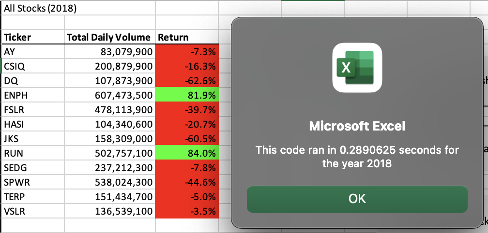

# Stock Analysis - Module 2 : VBA Challenge

## Overview of Project

### Background
Steve's parents are interested in 'Green' or environmentally friendly Stocks. We've created a program to review multiple tickers over multiple years using a AllStocksAnalysis module with VBA code. However, the code is not efficient and can be improved. This way if Steve would like to review a large number of stocks, the module will use less memory and still work without crashing. 

### Purpose
The purpose of this exercise is to use more efficient code. In using less steps and more abstract logic, code can become more efficient, use less memory, and decrease run time.

## Results & Analysis
In order to measure the performance of our two different approaches, we institute a timer to record the amount of time that elapses from the modules start to end. It is clear using the timer tool that the refactored approach is more efficient. 

### Analysis of Performance: AllStockAnalysis() Module

The original approach using the AllStockAnalysis() Module, iterates over each cell to determine its Volume, StartingPrice and EndingPrice. Then uses a for loop to iterate over the list for each cell, repeating the code. 

The original approach runs in 0.2890625 seconds. While this seems fast, our Refactored analysis shows there is room for improvement. 

### Analysis of Performance: AllStockAnalysisRefactored() Module

The improved approach using the AllStockAnalysisRefactored() Module instead stores the three variables (Volume, StartingPrice, and EndingPrice) into an array. By doing so we are able to create tickers within for loops, allowing us to reference arrays within the loops themselves. This makes the code more efficient and fully utilizes the object oriented tools provided in VBA. 

While the original approach runs in 0.2890625 seconds. The refactored approach runs in 0.09375 seconds, meaning the code runs more than 3 times faster than the original code. This is a significant increase on efficiency. 

### Summary

In general, refactoring code is always preferable as it produces more efficient and higher quality code. In addition, refactoring can make multiple calculations more simple and comprehensible. However, the disadvantages are whether the effort is worth it or not. While refactoring your code can improve it, re-writing code often comes with additional bugs and errors that need to be accounted for. In this example, if we never wanted to look at more than 12 tickers, it may not be worth it to re-write the program. 

The advantages of the updated VBA code is that it fully utilizes the object oriented nature of VBA. As shown, refactoring the code made the program run 3 times faster. However, a disadvantage is the number of variables used in the code. In referencing various tickers, it can be difficult to keep track of the significance of each variable. Also the nested for loops with All Stocks Analysis Refactored module introduces another level of complexity, as the correct indentation of various loops is vital to avoiding errors. 

In summary, refactoring can produce more efficient and higher quality code, but it should be determined if it is worth the effort given the task at hand. 

